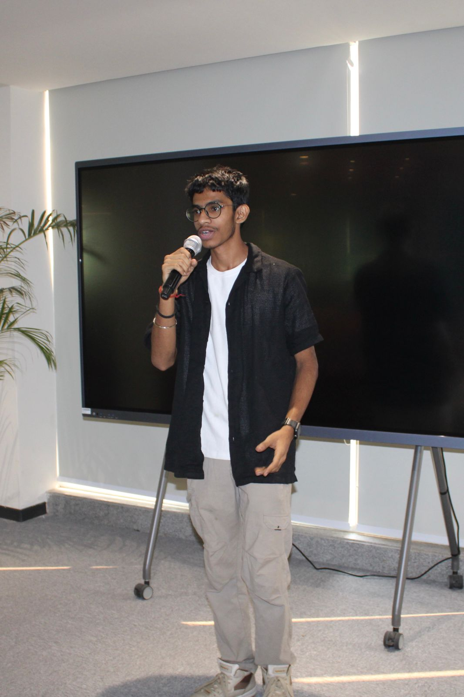

# Aditya Sharma - Developer Portfolio 🚀

A modern, highly interactive personal portfolio website designed to showcase my skills, experience, and projects. Built with a focus on smooth animations, performance, and a sleek dark-mode aesthetic.

 <!-- Update this path if you have a screenshot of the site -->

## ✨ Features

- **Interactive UI:** Smooth page transitions and scroll animations powered by Framer Motion.
- **Command Palette:** Press `Cmd + K` (or `Ctrl + K`) to quickly navigate through the site.
- **Custom Animations:** Features a dynamic canvas-based particle background and a custom interactive cursor.
- **Spotlight Cards:** Hover effects that reveal a subtle glowing spotlight on experience and education cards.
- **Terminal Aesthetic:** "Hacker-style" terminal windows for the About and Skills sections.
- **Fully Responsive:** Optimized for all devices, from mobile phones to large desktop screens.

## 🛠️ Tech Stack

- **Framework:** [React 18](https://react.dev/) (with [Vite](https://vitejs.dev/))
- **Language:** [TypeScript](https://www.typescriptlang.org/)
- **Styling:** [Tailwind CSS](https://tailwindcss.com/)
- **Animations:** [Framer Motion](https://motion.dev/)
- **Icons:** [Lucide React](https://lucide.dev/)

## 🚀 Getting Started

To get a local copy up and running, follow these simple steps:

### Prerequisites
Make sure you have Node.js and npm installed on your machine.

### Installation

1. Clone the repository:
   ```bash
   git clone https://github.com/your-username/your-repo-name.git
